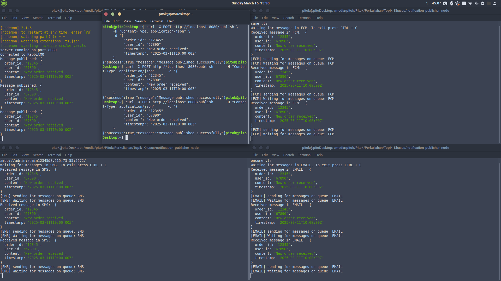

# RabbitMQ Sample Pub-Sub dengan Node.js dan Express.js

## 1. Install RabbitMQ

### Windows:
1. **Download dan Install Erlang** (RabbitMQ memerlukan Erlang):
   - Buka [Erlang Solutions](https://www.erlang.org/downloads) dan unduh versi terbaru untuk Windows.
   - Instal dengan pengaturan default.
   - Pastikan Erlang terinstal dengan menjalankan perintah berikut di Command Prompt:
     ```powershell
     erl
     ```
   - Jika Erlang berhasil terinstal, akan muncul prompt shell Erlang. Keluar dengan mengetikkan:
     ```erlang
     q().
     ```

2. **Download dan Install RabbitMQ**:
   - Buka [situs resmi RabbitMQ](https://www.rabbitmq.com/download.html) dan unduh installer Windows.
   - Instal RabbitMQ dengan pengaturan default.

3. **Menambahkan RabbitMQ ke PATH (jika perlu)**:
   - Pastikan `C:\Program Files\RabbitMQ Server\rabbitmq_server-<version>\sbin` telah ditambahkan ke PATH.
   - Bisa dilakukan secara manual melalui *Environment Variables*.

4. **Menjalankan RabbitMQ**:
   - Buka Command Prompt sebagai Administrator dan jalankan:
     ```powershell
     rabbitmq-server.bat
     ```
   - Untuk menjalankan RabbitMQ sebagai service (agar otomatis berjalan saat Windows dinyalakan):
     ```powershell
     rabbitmq-service install
     rabbitmq-service start
     ```

### macOS:
1. Install Homebrew jika belum ada:
   ```sh
   /bin/bash -c "$(curl -fsSL https://raw.githubusercontent.com/Homebrew/install/HEAD/install.sh)"
   ```
2. Install RabbitMQ:
   ```sh
   brew install rabbitmq
   ```
3. Jalankan RabbitMQ:
   ```sh
   brew services start rabbitmq
   ```

### Ubuntu:
1. Tambahkan repository RabbitMQ:
   ```sh
   sudo apt update
   sudo apt install rabbitmq-server -y
   ```
2. Jalankan RabbitMQ:
   ```sh
   sudo systemctl enable rabbitmq-server
   sudo systemctl start rabbitmq-server
   ```

## 2. Menjalankan, Menghentikan, dan Merestart RabbitMQ

### Windows:
- **Start**: `rabbitmq-server.bat`
- **Start sebagai service**: `rabbitmq-service start`
- **Stop**: `rabbitmqctl.bat stop`
- **Restart**: `rabbitmqctl.bat restart`

### macOS:
- **Start**: `brew services start rabbitmq`
- **Stop**: `brew services stop rabbitmq`
- **Restart**: `brew services restart rabbitmq`

### Ubuntu:
- **Start**: `sudo systemctl start rabbitmq-server`
- **Stop**: `sudo systemctl stop rabbitmq-server`
- **Restart**: `sudo systemctl restart rabbitmq-server`

## 3. Clone Aplikasi

```sh
git clone https://github.com/PitokDf/notification_publisher_node.git
cd notification_publisher_node
npm install
```

## 4. Menjalankan Aplikasi Publisher

```sh
npm run dev
```

## 5. Menguji Aplikasi Publisher

Gunakan `curl` untuk mengirim pesan:
```sh
curl -X POST http://localhost:8080/publish \
     -H "Content-Type: application/json" \
     -d '{
          "order_id": "12345",
          "user_id": "67890",
          "content": "New order received",
          "timestamp": "2025-03-11T10:00:00Z"
     }'
```

### Respon yang diharapkan:
```json
{"success":true,"message":"Message published successfully"}
```

## 6. Menjalankan Aplikasi Konsumer

```sh
npx ts-node consumer/smsConsumer.ts
npx ts-node consumer/emailConsumer.ts
npx ts-node consumer/fcmConsumer.ts
```

### Respon yang diharapkan:
```sh
[EMAIL] Waiting for messages on queue: EMAIL
Received message in EMAIL:  {
   order_id: '12345',
   user_id: '67890',
   content: 'New order received',
   timestamp: '2025-03-11T10:00:00Z'
}
[EMAIL] sending for messages on queue: EMAIL
```

### Hasil Akhir
